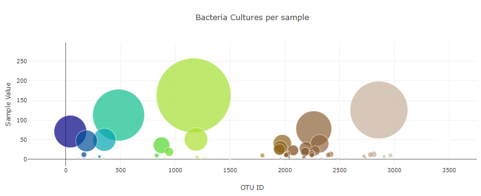
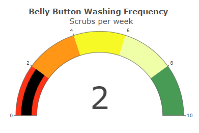

# Belly_Button_Biodiversity
Data Visualization in JavaScript

## Background

Create an interactive data visualization for the web to build an interactive dashboard exploring the Belly Button Biodiversity Dataset using Plotly.js, a JavaScript data visualization library.
 

## Objectives

* Create basic plots with Plotly, including bar charts, line charts, and pie charts.
* Use D3.json() to fetch external data, such as CSV files and web APIs.
* Use functional programming in JavaScript to manipulate data, using map(), filter(), and sort() methods.
* Use event handlers in JavaScript to add interactivity to a data visualization.
* Deploy an interactive chart to GitHub Pages.

## Results

* The final product can be found in the following webpage

https://sbaik97.github.io/Belly_Button_Biodiversity/

* Use the D3 library to read in `samples.json`.

### Step 2 - Horizontal Bar Chart

* Create a horizontal bar chart to display the top 10 bacterial species (OTUs), using JavaScript, Plotly, and D3.js.
* The horizontal bar chart will display the  sample_values as the values, the otu_ids as the labels, and the  otu_labels as the hover text for the bars on
the chart.

      * Code is written to create the arrays when a sample is selected from the dropdown menu
      * The x values are the sample_values in descending order.
      * The y values are the otu_ids in descending order.
      * The hover text is the otu_labels in descending order.
      * The top 10 sample_values are sorted in descending order.

### Step 3 - Bubble Chart

* Create a  bubble chart to display the otu_ids and sample_values 
* Create a  bubble chart to display the otu_ids and sample_values when an individual’s ID is selected from the dropdown menu webpage.

      * The otu_ids as the x-axis values.
      * The sample_values as the y-axis values.
      * The sample_values as the marker size.
      * The otu_ids as the marker colors.
      * The text for a bubble is shown when hovered over

### Step 3 - Gauge Chart

* Display the sample metadata from the route `/metadata/<sample>`
    * Display each key/value pair from the metadata JSON object somewhere on the page

* Update all of the plots any time that a new sample is selected

* Adapt the Gauge Chart from <https://plot.ly/javascript/gauge-charts/> to plot the Weekly Washing Frequency obtained from the route `/wfreq/<sample>`
    * Modify the example gauge code to account for values ranging from 0 - 9
    * Update the chart whenever a new sample is selected

## Where does the data come from?

The data is provided by Monash University Data Analytics Bootcamp.

## What did I do?

In this assignment, I've built an interactive dashboard to explore the [Belly Button Biodiversity dataset](http://robdunnlab.com/projects/belly-button-biodiversity/), which catalogs the microbes that colonize human navels.

The dataset reveals that a small handful of microbial species (also called operational taxonomic units, or OTUs, in the study) were present in more than 70% of people, while the rest were relatively rare.

1. Use the D3 library to read in `samples.json`.

2. Create a horizontal bar chart with a dropdown menu to display the top 10 OTUs found in selected test ID.

3. Create a bubble chart that displays each sample.

4. Display the sample metadata, i.e., an individual's demographic information.

5. Create the Gauge Chart to plot the weekly washing frequency of the individual.

6. Update all of the plots any time that a new sample is selected.

7. Deploy the app to [GitHub Pages](https://momcancode.github.io/plotly-challenge/).
